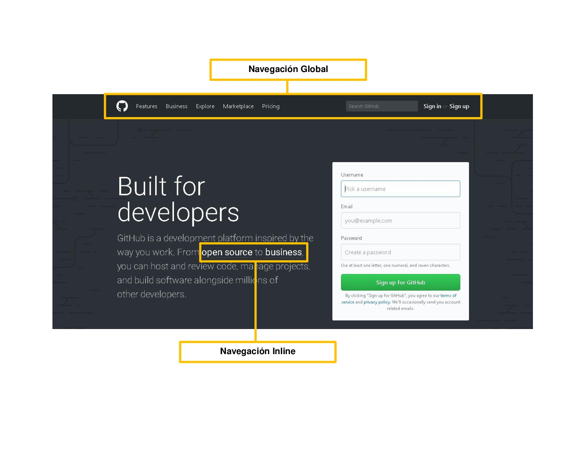
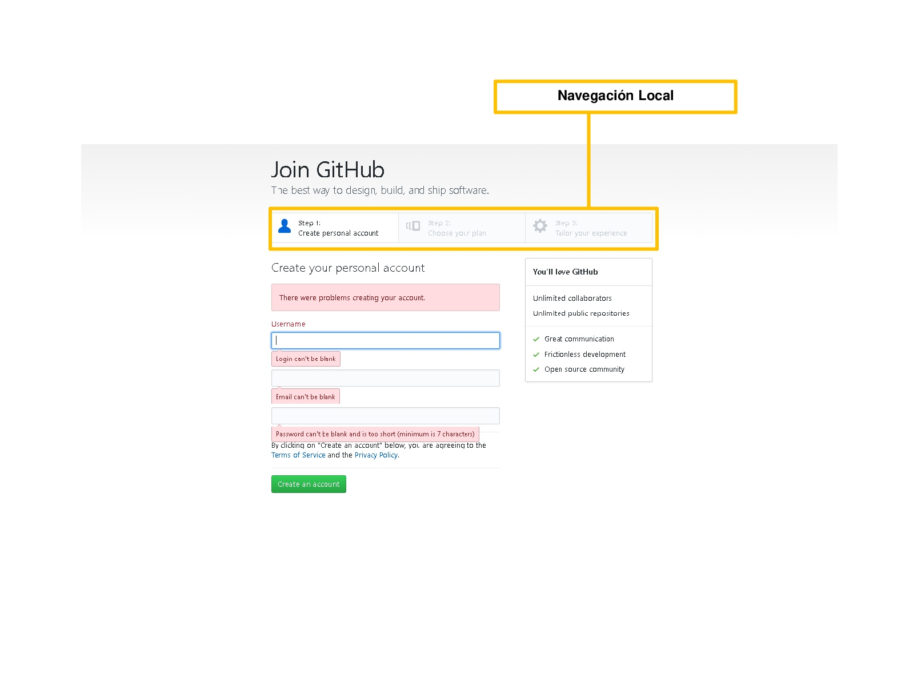

## RETO UX - LABORATORIA WEEBSITE

UI:
 - Paletas de colores: amarillo, blanco y negro
 - Botones: fondo amarillo tipografía negra, fondo blanco tipografía y borde amarillo
 - Botones redes sociales (fixed)
 - Logo
 - Tipografía
 - Posicionamiento de imágenes
 - Diseño de imágenes y texto combinados.
 - Textos alineados al centro
 - Diseño de footer
 - Plantear flujo del programa a través de los botones y clicks

UX:

Objetivo de negocio:
 - Postulación de nuevas estudiantes
 - Empresas contratando nuestro talento LABORATORIA
 - Capacitación de empresas

Utilidad:
- Postulación, contratación de talento Laboratoria y capacitación de empresas.

Usabilidad:
- Fácil navegación y entendimiento.
- Deseable a traves del diseño.

Elementos UX:
 - Imágenes alumnas: Confianza, calidez, curiosidad, esperanza.
 - Texto alumnas: Pitch motivador.
 - Imágenes empresas: Confianza, seguridad, credibilidad, posicionamiento, seriedad.
 - Texto empresas: Confianza, seguridad, impacto, innovación, posicionamiento.

## RETO UX - TIPOS DE NAVEGACIÓN GITHUB

## RETO SKETCH - DASHBOARD LABORATORIA

